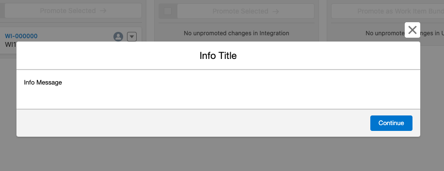
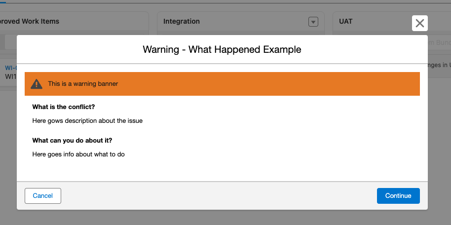

# Pre-Promote Validators

Pre-Promote Validators run every time a promotion is attempted and serve two purposes. First, they allow for custom business processes to be inserted into the promotion validation. Second, they allow custom business logic to control the options in the promotion dialog.

In this repository, we have provided some examples on how to create custom ones.

## Validation

When a promotion is initiated, there is a lot of validation that happens before we begin the process of merging and deploying the metadata. This is to ensure, as best we can, that the promotion will succeed.


The initial validators that run are written by the DevOps Center team, and you see them running in every promotion. Now, with the global interfaces that are available, customers can write their own validators that are called as part of the pre-promotion process.

There are two steps to creating a custom pre-promote validator. First, you need to implement two Apex classes, which are called when the validation is needed. Second, you need to insert a custom metadata type to declare that the validator is present. This section of the document explains how these are accomplished.

### Validator

The first Apex class you need to implement must extend `sf_devops.PrePromoteProvider`. This class is just a factory class used as a single point of entry into your custom code. It is used for both the validator and the promotion options flows. It has methods to access each. For the validator, implement the method:

```
sf_devops.PrePromoteValidator getValidator();
```

The second class you need to implement is the actual validator, and it must extend `sf_devops.PrePromoteValidator`. This contains the methods that are called during the validation process.

#### Include Method

The include method is called very early in the process and is used to determine if this validator should be included in a promotion. As an example, let's say you have a validator and it is only designed to work when promoting into the bundling stage of the pipeline. You can implement this method by looking to see if the target stage has `sf_devops__Prerelease__c` set to true.

```
Boolean include(sf_devopd.SpiPrePromoteContext      context);
```

The default implementation of this method is to return `true` and include all validators in the pre-promotion validation.

#### getRunningMessage()

This is called when to get the message that is displayed in the UI when this validator is running.

```
String getRunningMessage()
```

If this is not implemented, we display the label of the custom metadata type that was used to declare this validator.

#### validate

This is the method that is called to perform the actual validation. This can be implemented however you like. Each pre-promote validator is called in a separate Apex transaction, so you have a full set of limits at your disposal.

```
sf_devops.SpiPrePromoteValidationResponse validate(
        sf_devops.SpiPrePromoteContext context
    );
```

The result types are discussed below.

#### invokeCustomAction

One of the possible results that you can return from the `validate` method is a custom continue override (more details below). If you do specify that as a result, then this is the method that is called when the user performing the promotion invokes your custom continue.

```
void invokeCustomAction(sf_devops.SpiPrePromoteContext context)
```

### sf_devops.SpiPrePromoteContext

The context is passed into almost all of the methods on the validator and it gives you information about what is being promoted and where it is being promoted to. Here are the properties available on the context.

**List<SpiWorkItem> getSelectedWorkItems()**. This returns the list of work items that are selected for promotion. This will be null when a bundle is being promoted. For each work item, you get the ID and a flag to state if the work item was selected, or if it was auto-selected because it was externally merged.

**Id getTargetStageId();**: The ID of the `Pipeline_Stage__c` that is the target of this promotion.

**List<SpiChangeBundle> getSelectedChangeBundles()**: This is the list of change bundles that are part of this promotion. This will be null if this is not a versioned promotion. For each bundle, you get the ID of the `Change_Bundle__c` (can be used to load the Work Items in the bundle) and a flag that lets you know if the bundle was externally merged.

**List<Id> getVisibleWorkItemIds()**: This returns all of the IDs of all of the work items that are visible in the source stage. This will be null for a versioned promotion.

**List<Id> getVisibleChangeBundleIds()**: This returns all of the IDs of all of the change bundles that are visible in the source stage. This will be null for a non-versioned promotion.

**Boolean getUndeployedOnly()**: This flag is true if the user selected the `Complete Promotion` button on the target stage to deploy externally merged metadata only. It will be false if the user selected the Promote button.

### sf_devops.SpiPrePromoteValidationResponse

The responses are designed to give implementors as much flexibility as we could to convey information to the user that is doing the promotion. There are two ways that implementors can control the pre-promotion process. These are described below.

#### Result Type

The type of the result returned controls if information is displayed to the user, and if it is it controls the buttons available to the user. There are four options:

**Pass**: If this is the result, then no information is displayed to the user and the validation continues to the next validator. A passing result type if created by calling `sf_devops.SpiPrePromoteValidationResponse.pass()`. There are no further options available on a passing result.

**Info**: An informational response pauses the validation process and presents content to the user. It gives the user a `Continue` button and when pressed the validation continues to the next validator. An informational result type is created by calling `sf_devops.SpiPrePromoteValidationResponse.info()`. After the call to `info` you are able to configure the content.

**Warn**: A warning response pauses the validation process and present content to the user. It gives the user a `Cancel` and a `Continue` button. If `Cancel` is selected, then the protion process stops. If `Continue` is selected the validation continues to the next validator. A warning result type is created by calling `sf_devops.SpiPrePromoteValidationResponse.warn()`. After the call to `warn` you are able to configure the content.

**Fail**: A failure response pauses the validation process and present content to the user. It gives the user a `Cancel` button. When `Cancel` is selected, then the promotion process stops. A failure result type is created by calling `sf_devops.SpiPrePromoteValidationResponse.fail()`. After the call to `warn` you are able to configure the content.

#### Result Content

Regardless of the result type (info, warn or fail) you have the following two options availble to present content to the user.

##### simple

Simple content is just as the name implies. You can specify a title and Rich Text Format for the body of the dialog. With the Rich Text Format you can create links, tables, insert images, anything that is supported in the `lightning-formatted-rich-text` LWC component.

After the result type is choosen (info(), warn() or fail()) you specify simple result content as follows:

```
simple('Title here', 'Content Here').build();
```

Here is an example of a simple informational response:



That was created with:

```
return sf_devops.SpiPrePromoteValidationResponse.info()
        .simple()
        .withTitle('Info Title')
        .withMessage('Info Message')
        .build();
```

##### What Happened

Many of DevOps Center validators use a "What Happened" and "What can I do about it" layout for the validation response. If you would like to give a similar look and feel in your response, you can create this with the `whatHapened()` method. After the result type has been chosen (info(), warn(), fail()). After `whatHappened()` there are many other methods to further configure the content of the dialog.

Here is an example of a What Happened warning dialog:



And here is the code that created it.

```
return sf_devops.SpiPrePromoteValidationResponse.warn()
  .whatHappened()
  .withTitle('Warning - What Happened Example')
  .withDetail('Here goes description about the issue')
  .withSuggestion('Here goes info about what to do')
  .withWarningBanner('This is a warning banner')
.build();

```

##### Custom Continue

When you create a `warn()` result type, one of the options you have is to customize the `Continue` button. An example of this in DevOps Center is when a user tries to promote a work item from the `Approved` column that has an unmergable change request. We present the user with a `warn()` result, but we override the `Continue` button. In this case, we offer the option to revert the work item back to the development phase.

Please note, we call this a "continue override", as we replace the functionality of the `Continue` button. However, the user is not given an option to continue the promotion. Either they cancel the promotion, or the custom logic is invoked.
If you would like to override the continue action, use the `withCustomContinue` method. This allows you to specify the new label for the continue button, and a message to display when the action is invoked.

```
global sf_devops.SpiContinuePrePromoteBuilder withCustomContinue(
        String buttonLabel,
        String initiatingMessage
    )
```

See the section above on implementing the `invokeCustomAction()`. This is called when the user selects your custom continue button.

## Promote Options

Besides validation, the Pre-Promote framework allows customers to control the initial state of the promte options dialog. This is shown after all of the validators have run and allows the user to configure the actual promotion into the next stage.


The options that are displayed in the dialog are dependent on the type of promotion being performed (Non-Bundled, Bundling or Bundled).

Note: a `PrePromoteProvider` is used to access the promote options, just like a validator. When you are implementing, you don't need to specify both on the same Provider; you can specify just a validator or a promote options.

### Deployment Type

Controlling the deployment type allows you to configure what metadata is deployed in the promotion. You can either deploy the metadata that is associated with the work items, or all of the metadata in the stage.

```
sf_devops.SpiDefaultPromoteOptionsBuilder setDeploymentType(
        sf_devops.SpiDeploymentType deploymentType,
        Boolean deploymentTypeModifiable
    )
```

You can pass either FULL or PARTIAL as the deployment type. You can also control if the user is allowed to change this in the dialog.

### Test options

Controlling the test options allows you to configure what set of test are run after the metadata deployment into the target stage.

```
sf_devops.SpiDefaultPromoteOptionsBuilder setTestOptions(
        sf_devops.SpiTestLevel lestLevel,
        String specifiedTests,
        Boolean testLevelModifiable
    )
```

You can pass DEFAULT, RUN_LOCAL_TESTS, RUN_ALL_TESTS_IN_ORG,RUN_SPECIFIED_TESTS as the testLevel. If you choose RUN_SPECIFIED_TESTS, then you can pass in the semi-colon separated list of Apex test classes to run. You can also specify if the user is allowed to change these selections.

### Promotion Type

When performing a Bundling or Bundled promotion, the user has the option to choose a normal promotion, or a check deploy. These can be controlled with:

```
sf_devops.SpiDefaultPromoteOptionsBuilder setPromotionType(
        sf_devops.SpiPromotionType promotionType,
        Boolean promotionTypeModifiable
    )
```

For the promotion type you can specify PROMOTE or CHECK_DEPLOY. You can also control if the user is allowed to modify the value.

### Version Name

When performing a bundling promotion, the user is prompted for a new version name. This can be controlled with:

```
sf_devops.SpiDefaultPromoteOptionsBuilder setVersionName(
        String versionName
    )
```

You can specify the default version name to display. This field is always modifiable.

## See Examples

This repository contains many examples of Pr-Promote Validators.

[PrePromote Info](./examples/PrePromoteInfo.md)  
[PrePromote Warning](./examples/PrePromoteWarning.md)  
[PrePromote Custom Continue](./examples/PrePromoteOverride.md)  
[Promotion Tasks](./examples/PromoteTasks.md)  
[Promote Options](./examples/PromoteOptions.md)
