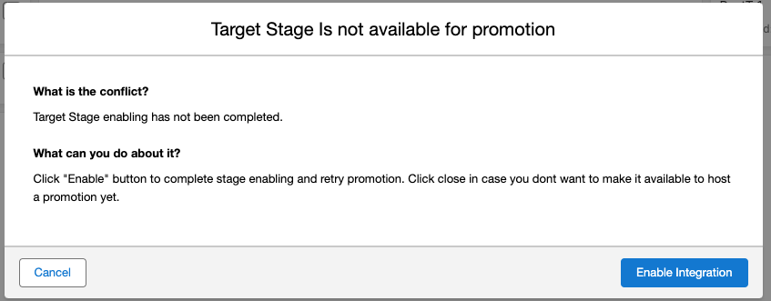

# Pre-Promotion with Custom Continue Override

**User Case**: As the release manager, I would like to present the user with a warning dialog. If the user cancels the promotion I would like to execute some custom Apex code.

## Overview

In some cases knowing that the user canceled the promotion as a result of a warning is needed to completly implement the business process. The Pre-Promote Validator framework allows this by specifing a continue override action.



In this example, we want the user to acknowledge the promotion to a stage. We show a warning dialog with the continue override, and when the user presses the "enable" button we set a flag on the `Pipeline_Stage__c` to mark it as enabled.

## Details

### Validate

The validator uses a new custom field we added called `Is_Available__c`. It loads the `Pipeline_Stage__c` to see if this field has been set. If set, then the validator passes. If not, then the validator returns the "What Happened" dialog with the custom continue override.

```
    global override sf_devops.SpiPrePromoteValidationResponse validate(
      sf_devops.SpiPrePromoteContext context
    ) {
      // Will use the context to get target stage name
      Id targetStageId = context.getTargetStageId();
      sf_devops__Pipeline_Stage__c targetStage = [
        SELECT Id, Name, Is_Available__c
        FROM sf_devops__Pipeline_Stage__c
        WHERE Id = :targetStageId
      ];

      // Check if this stage is available to receive a promotion

      if (targetStage.Is_Available__c) {
        return sf_devops.SpiPrePromoteValidationResponse.pass();
      }

      String name = targetStage.Name;
      return sf_devops.SpiPrePromoteValidationResponse.warn()
        .withCustomContinue('Enable ' + name, 'enabling target stage')
        .whatHappened()
        .withTitle('Target Stage Is not available for promotion')
        .withDetail('Target Stage enabling has not been completed.')
        .withSuggestion(
          'Click "Enable" button to complete stage enabling and retry promotion. Click close in case you dont want to make it available to host a promotion yet.'
        )
        .build();
    }

```

### InvokeCustomAction

When the user selects the custom continue button, the promotion process is terminated and DevOps Center calls the `invokeCustomAction()` method on the Pre-Promote Validator. This is where follow-on business logic can be applied. In this case we set the `Is_Available__c` flag on the target stage to true.

```
    global override void invokeCustomAction(
      sf_devops.SpiPrePromoteContext context
    ) {
      Id targetStageId = context.getTargetStageId();

      // Update target stage is Available to host promotions.
      // This will make the target stage available from promotion
      update new sf_devops__Pipeline_Stage__c(
        Id = targetStageId,
        Is_Available__c = true
      );
    }
```

## Relevant Files

- [WarningPrePromoteProviderOverrideAction.cls](../../force-app/main/default/classes/prePromote/WarningPrePromoteProviderOverrideAction.cls): Implementation of the Pre-Promote Validator
- [sf_devops\_\_Service_Provider.WarningOverride_PrePromote_Validator.md-meta.xml](../../force-app/main/default/customMetadata/sf_devops__Service_Provider.WarningOverride_PrePromote_Validator.md-meta.xml): Custom Metadata Type to enable the Pre-Promote Validator

# See Also

[PrePromote Validators](../PrePromoteValidators.md)
